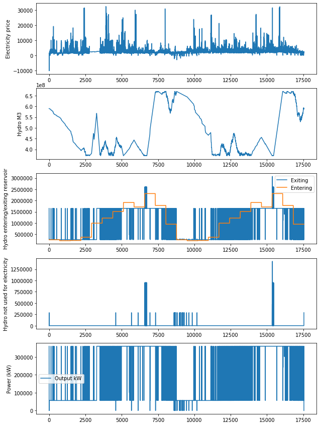

# Optim-Dispatch-Hydroplant

  Problem
Here, we consider a simple optimization problem related to the hourly scheduling of small hydro power dispatch. 
The goal is construct a feasible solution that maximize the cascade electricity production, following the environmental constraints and water balance. The paper proposes an improved Particle Swarm Optimization (PSO) algorithm, which takes advantage of simplicity and facility of implementation. The algorithm was successfully applied to the optimization of the daily schedule strategies of small hydro power plants, considering maximum water utilization and all constraints related to simultaneous water uses. Extensive computational tests and comparisons with other heuristics methods showed the effectiveness of the proposed approach
